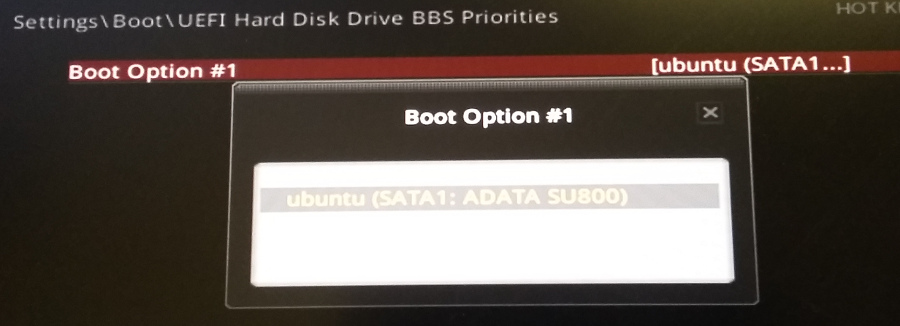
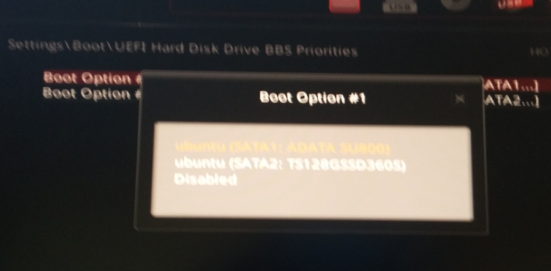

# Part 1

At first there had been disk sda with two partitions:
- /dev/sda1: ESP
- /dev/sda2: Ubuntu 18.04

Then I connected second disk sdb and installed Ubuntu 22.04 on it. During installation following partitions were created:
- /dev/sdb1: FAT32 for ESP. 
- /dev/sdb2: ext4 for /
- /dev/sdb3: ext4 for /home

I intended to make separate EFI partitions for Ubuntu 22.04 on /dev/sdb1 and leave ESP on /dev/sda1 intact. Motivation was to not alter Ubuntu-18's GRUB but I messed up and Ubuntu-22's GRUB was dumped on /dev/sda1 and /dev/sdb1 was leaved empty. From the MAN page of efibootmgr:

> An OS installer would call efibootmgr -c. This assumes that /boot/efi is your EFI System Partition, and is mounted at /dev/sda1.

So U-22 was installed and booted normally while U-18 failed to boot even though there was entry for it in the GRUB menu. I was able to fix this (XXX describe how).

Anyway now when I'm logged-in U-18:

```
>efibootmgr -v

BootCurrent: 0000
Timeout: 1 seconds
BootOrder: 0000,0001
Boot0000* ubuntu	HD(1,GPT,5307826d-84e7-4497-89df-234a9b109f94,0x800,0xf3800)/File(\EFI\UBUNTU\SHIMX64.EFI)
Boot0001  Hard Drive	BBS(HD,,0x0)/VenHw(5ce8128b-2cec-40f0-8372-80640e3dc858,0200)..GO...
```

This are the records within UEFI Boot Manager that are stored in the NVRAM on the motherboard. They were added by UEFI firmware itself. 

`5307...9f94` is PARTUUID of /dev/sda1 EFI partition (remember that UUID is an attribute of filesystem and PARTUUID - of partition). `HD(1,GPT` probably means disk #1 (sda) with GPT partition table.

```
>sudo blkid | grep -v loop 

/dev/sda1: UUID="1E86-1FD7" TYPE="vfat" PARTUUID="5307826d-84e7-4497-89df-234a9b109f94"
...
```

???
===
What is `BBS(HD,,0x0)` and this id `5ce8128b-2cec-40f0-8372-80640e3dc858,0200`? It is all over the Internet so it has nothing to do with UUID/GUID on my particular computer.

# Part 2

This is how BBS priorities option in UEFI looks so far:



What happens if to copy data from /dev/sda1 to /dev/sdb1?

```
>md /tmp/sda1
>md /tmp/sdb1
>sudo mount /dev/sda1 /tmp/sda1
>sudo mount /dev/sdb1 /tmp/sdb1
>sudo cp -r /tmp/sda1/EFI /tmp/sdb1
>sync
>reboot
```

This is how BBS priorities option in UEFI looks now:



Second item in the list has appeared. It seems UEFI firmware has detected non-empty ESP on the SATA2 (sdb) and thus has included it in the list.

```
>efibootmgr -v

BootCurrent: 0000
Timeout: 1 seconds
BootOrder: 0000,0001, 0002
Boot0000* ubuntu	HD(1,GPT,5307826d-84e7-4497-89df-234a9b109f94,0x800,0xf3800)/File(\EFI\UBUNTU\SHIMX64.EFI)
Boot0001  Hard Drive	BBS(HD,,0x0)...
Boot0002* ubuntu	HD(1,GPT,e25ce0d9-4902-4438-8f1e-617ed649ab41,0x800,0xf3800)/File(\EFI\Ubuntu\shimx64.efi)..BO
```

```
>sudo blkid | grep -v loop 

/dev/sda1: UUID="1E86-1FD7" TYPE="vfat" PARTUUID="5307826d-84e7-4497-89df-234a9b109f94"
...
/dev/sdb1: UUID="C5AE-10A6" TYPE="vfat" PARTUUID="e25ce0d9-4902-4438-8f1e-617ed649ab41"
...
```

Now I'm going to set sdb as a first item in BBS Priorities list instructing UEFI firware to boot from sdb1. I expect same boot process because data on sdb1 is the same as on sda1.

It is the same indeed. No problem logging into both U-18 and U-22. Here is the state of UEFI Boot Manager:

```
>efibootmgr -v

BootCurrent: 0004
Timeout: 1 seconds
BootOrder: 0002,0000,0001
Boot0000* ubuntu	HD(1,GPT,5307826d-84e7-4497-89df-234a9b109f94,0x800,0xf3800)/File(\EFI\UBUNTU\SHIMX64.EFI)
Boot0001  Hard Drive	BBS(HD,,0x0)..
Boot0002* ubuntu	HD(1,GPT,e25ce0d9-4902-4438-8f1e-617ed649ab41,0x800,0xf3800)/File(\EFI\UBUNTU\SHIMX64.EFI)..BO
```

Now, say I want to install Windows as well but afraid that it will mess up sda1 EFI partition. But having second ESP on sdb1 I can proceed without worries.

Замечание про GUID раздела
==========================
```
>lsblk -p -o NAME,PARTTYPE | grep -v loop
NAME        PARTTYPE
/dev/sda    
├─/dev/sda1 c12a7328-f81f-11d2-ba4b-00a0c93ec93b
└─/dev/sda2 0fc63daf-8483-4772-8e79-3d69d8477de4
/dev/sdb    
├─/dev/sdb1 c12a7328-f81f-11d2-ba4b-00a0c93ec93b
├─/dev/sdb2 0fc63daf-8483-4772-8e79-3d69d8477de4
└─/dev/sdb3 0fc63daf-8483-4772-8e79-3d69d8477de4
/dev/sdc    
├─/dev/sdc1 0fc63daf-8483-4772-8e79-3d69d8477de4
└─/dev/sdc2 0657fd6d-a4ab-43c4-84e5-0933c84b4f4f
```