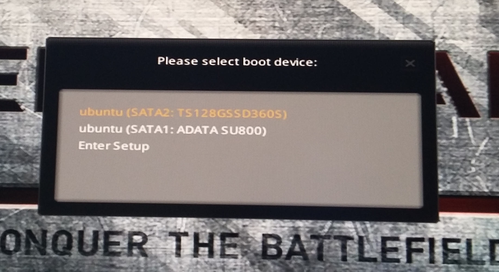

# UEFI

PC motherboard has NVRAM (non-volatile random access memory) flash memory that stores UEFI's firmware code and durable state. Firmware code is supplied by motherboard vendor. Think about it as a very limited OS whose files live in NVRAM instead of SSD. Purpose of "UEFI OS" is to configure hardware and set up booting of real OS. Boomers are thinking about BIOS right now.

> XXX UEFI is the same as EFI

## UEFI applications

- executable *.efi files that can be run by UEFI firmware
- resides on the ESP (EFI System Partition)
- bootloader like GRUB
- boot manager like rEFInd
- EFI shell is also an app

## ESP - EFI System Partition

 ESP is a partition with FAT32 filesystem that holds efi-executables like bootloader or shell and configuration files. Sane beaviour is to have no more than one ESP per disk.

## GPT

XXX

## EFI boot manager

BM is EFI application whose task is to present user menu of boot options that could be bootloader, OS kernel, EFI shell. Boot manager maintains list of boot options in NVRAM. Typically item of the list is ESP's PARTUUID and path to booloader executable within this partition.

BM can be supplied by motherboard vendor but they are usually very primitive. There are better third party BM's e.g. rEFInd. 

This is look of boot built-in manager by MSI. It can be invoked by pressing F11 after turning op computer.



Here are corresponding NVRAM vars:

```
>efibootmgr -v
BootCurrent: 0000
Timeout: 1 seconds
BootOrder: 0000,0002,0001
Boot0000* ubuntu	HD(1,GPT,e25ce0d9-...,0x800,0xf3800)/File(\EFI\UBUNTU\SHIMX64.EFI)
Boot0001  Hard Drive	BBS(HD,,0x0)...
Boot0002* ubuntu	HD(1,GPT,5307826d-...,0x800,0xf3800)/File(\EFI\UBUNTU\SHIMX64.EFI)..BO

>sudo blkid | grep -v loop
/dev/sda1: UUID="..." TYPE="vfat" PARTUUID="5307826d-..."
/dev/sdb1: UUID="..." TYPE="vfat" PARTUUID="e25ce0d9-..."
...
```

## Bootloader

Bootloader is EFI aplication that handles the task of loading OS kernel from disk (sometimes with auxiliary files like Linux initial RAM disk) to memory and starting the kernel running.

> GRUB is both boot manager and boot loader. It provides menu of boot options and can launch dedicated boot loader for e.g. Windows. But GRUB is also capable of launching Linux kernel thus being a boot loader for Linux systems.