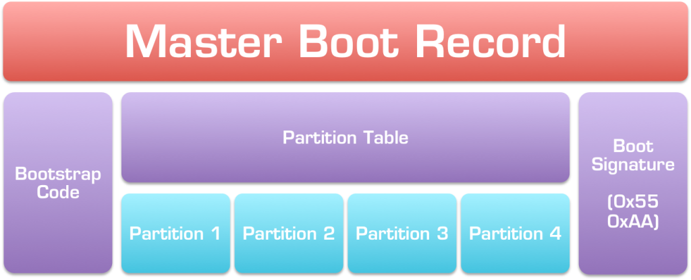
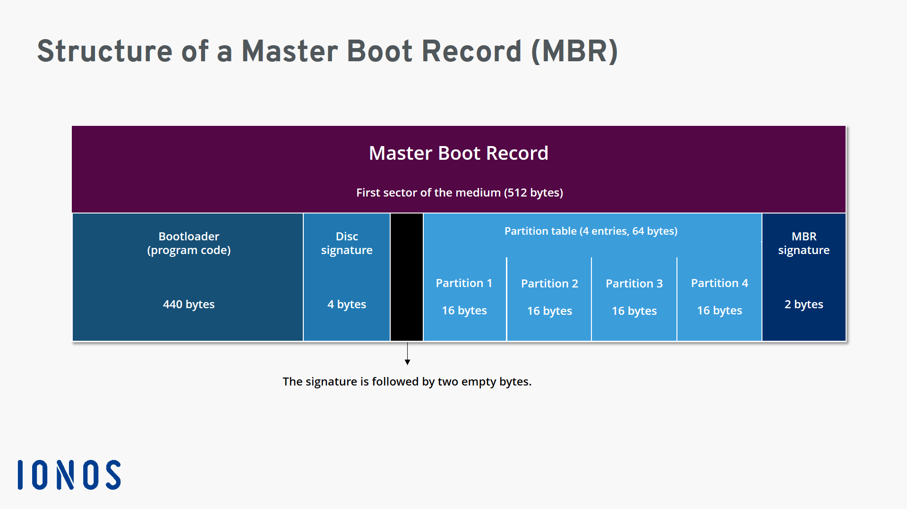
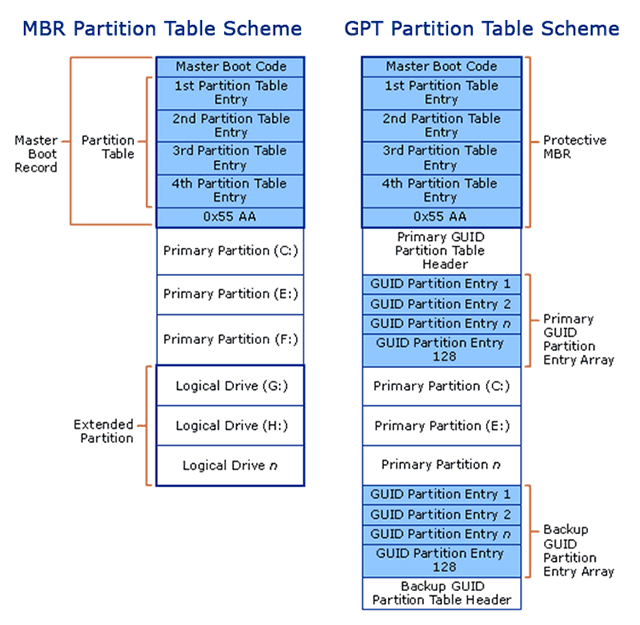
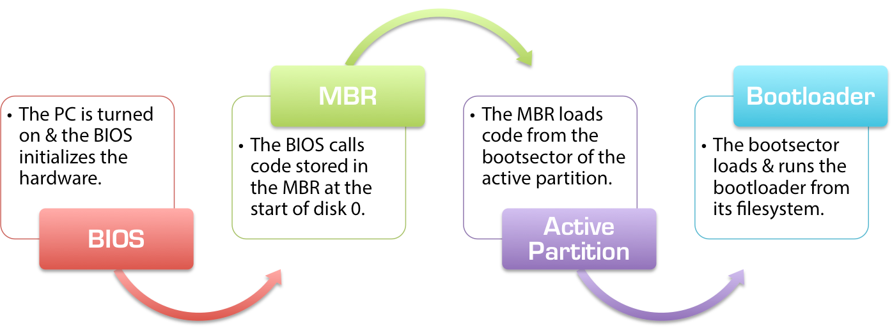

# BIOS - Basic Input/Output System

The BIOS is a firmware that comes with the motherboard. The BIOS instructions are stores in the BIOS chip on the motherboard. The BIOS chip is non-volatile: contents of a chip is retained after power is turned off.

CMOS chip stores user's settings. CMOS chip is volatile: it needs constant power. Resseting CMOS battery will restore default BIOS settings. On modern motherboards the CMOS chip is integrated with the RTC (real-time clock) on the south bridge chipset.

** MBR - Master Boot Record**
_______

MBR is the old standard for managing the partition in the hard disk. It is superseded by GPT. The MBR resides at the very beginning of the hard disk and it holds the information on how the logical partitions are organized in the storage device. In addition, the MBR also contains executable code that can scan the partitions for the active OS and load up the boot up code/procedure for the OS.

The organization of the partition table in the MBR limits the maximum addressable storage space of a partitioned disk to 2 TiB (232 × 512 bytes). *XXX: Are limits applied to a whole disk or to a separate partition?* 4 primary partitions per disk.

Can not repair itself, boot data is stored in one place, if data is everwritten or corrupted - fail to boot.

**BIOS booting**
________________

On BIOS PC you have one or more disks which have an MBR. The MBR is another de facto standard: the very start of the disk describes the partitions on the disk in a particular format, and contains a 'boot loader', a very small piece of code that a BIOS firmware knows how to execute, whose job it is to boot the operating system(s).

All a BIOS firmware knows, in the context of booting the system, is what disks the system contains. You, the owner of this BIOS-based computer, can tell the BIOS firmware which disk you want it to boot the system from. The firmware has no knowledge of anything beyond that. It executes the bootloader it finds in the MBR of the specified disk, and that's it. The firmware is no longer involved in booting.

In the BIOS world, absolutely all forms of multi-booting are handled above the firmware layer. The firmware layer doesn't really know what a bootloader is, or what an operating system is. It doesn't know what a partition is. All it can do is run the boot loader from a disk's MBR. You also cannot configure the boot process from outside of the firmware.

https://neosmart.net/wiki/mbr-boot-process/

# UEFI - Unified Extensible Firmware Interface

Spec for UEFI - https://uefi.org. Includes a disk partitioning scheme - GPT. 

New type of BIOS that has several advantages over old one:

* User friendly graphical UI with mouse
* UEFI supports drive sizes upto 9 zettabytes, whereas BIOS only supports 2.2 terabytes
* Secure Boot

# GPR - GUID Partition Table

* Supports upto 128 partitions per disk, with upto to 2^64*512 = 9.4 zettabytes = 9448928051 Gb.
* Stores multiple copies of data across the disk
* Can recover if corrupted, cyclic redundancy check (CRC) is used to determine if data is intact.

**ESP - Extensible System Partition**
_____________________________________

ESP is the independent from OS partition which stores the UEFI boot loader, application and driver used by UEfI firmware. ESP is mandatory for Linux, Windows and MacOS.

# Boot Loader

* The boot loader is used to identify where the kernel of the operating system is located. 
* For Linux b.l. is usually GRUB - Grand Unified Boot Loader. 
* The final b.l.'s call is to load process ID 1 - systemd or initd.

**Debian Bootstrap Process**
____________________________

1. UEFI

2. Boot Loader (GRUB)

Grub may stop and dispaly options for the user - what OS or kernel to load.

3. Mini-Debian System

Optional step used to load drivers needed to load main kernel from disk.

4. Normal Debian System

# Boot Procedure

https://www.freecodecamp.org/news/uefi-vs-bios/

1. You press the power button on your laptop/desktop.

2. The CPU starts up, but needs some instructions to work on (remember, the CPU always needs to do something). Since the main memory is empty at this stage, CPU defers to load instructions from the firmware chip on the motherboard and begins executing instructions.

3. The firmware code does a Power On Self Test (POST), initializes the remaining hardware, detects the connected peripherals (mouse, keyboard, pendrive etc.) and checks if all connected devices are healthy. You might remember it as a 'beep' that desktops used to make after POST is successful.

4. Finally, the firmware code cycles through all storage devices and looks for a boot-loader (usually located in first sector of a disk). If the boot-loader is found, then the firmware hands over control of the computer to it.

5. So now that the boot-loader is loaded, its job is to load the rest of the operating system. GRUB is one such boot-loader that is capable of loading unix-like operating systems and is also able to chain-load Windows OS. Boot-loader is only available in the first sector of a disk, which is 512 bytes. Given the complexity of modern operating systems, some of these boot-loaders tend to do multi-stage loading, where the main boot-loader loads the second-stage-boot-loader in an environment which is not restricted to 512 bytes.

6. The boot-loader then loads the kernel into memory.

# UEFI boot manager

# sources

https://www.happyassassin.net/posts/2014/01/25/uefi-boot-how-does-that-actually-work-then/

https://www.maketecheasier.com/differences-between-mbr-and-gpt/

https://www.youtube.com/watch?v=BBUPc0aO5lw