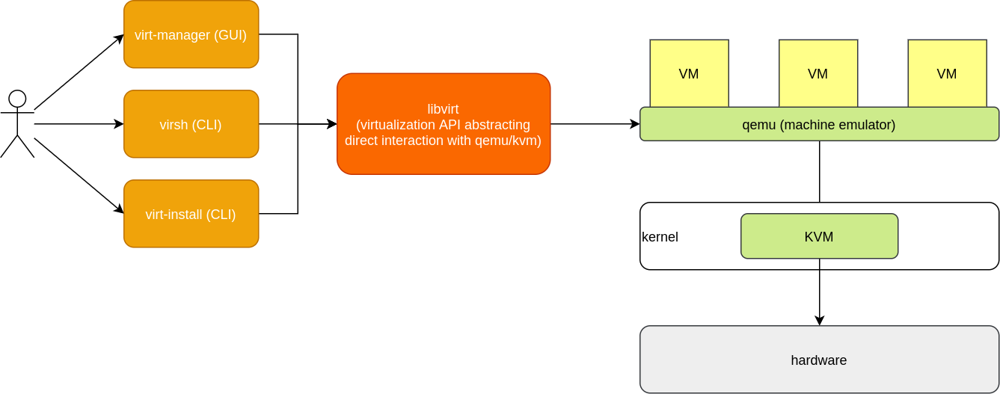

Check if CPU supports virtualization

```
egrep -c '(vmx|svm)' /proc/cpuinfo
```

libvirt 

> Libvirt is a C toolkit to interact with the virtualization capabilities of recent versions of Linux (and other OSes). The library aims at providing a long term stable C API for different virtualization mechanisms. It currently supports QEMU, KVM, XEN, OpenVZ, LXC, and VirtualBox.




#### Packages to install
* **qemu-kvm**: provides just a wrapper
 script /usr/bin/kvm which run qemu-system-x86 in kvm mode for backwards
 compatibility
* libvirt-clients: contains the libvirt shell `virsh` and other client binaries
* libvirt-daemon: contains the daemon libvirtd to manage the hypvervisors
* libvirt-daemon-system: contains the configuration files to run the libvirt daemon as a
 system service
* bridge-utils
  >This package contains utilities for configuring the Linux Ethernet bridge in Linux. The Linux Ethernet bridge can be used for connecting multiple Ethernet devices together. The connecting is fully  transparent: hosts connected to one Ethernet device see hosts connected to the other Ethernet devices directly.
* virtinst
  >Virtinst is a set of commandline tools to create virtual machines using libvirt:
  - virt-install: provision new virtual machines
  - virt-clone: clone existing virtual machines
  - virt-image: create virtual machines from an image description
  - virt-convert: convert virtual machines between formats
* virt-manager
  > The virt-manager application is a desktop user interface for managing virtual machines through libvirt.

### why does virsh/libvirt call virtual machines domains?

Original definition of domain: "an area of territory owned or controlled by a particular ruler or government."

In computer networking, a domain name "defines a realm of administrative autonomy, authority or control within the Internet"

So a domain is just a subset within a larger space. In computer networking, it is a subset of an address space.

And in computer virtualization, a domain (virtual machine) is a subset of hardware resource space.

https://unix.stackexchange.com/a/614098

### virsh commands

List of all VMs
```bash
> virsh list --all
```

List storage pools
```bash
> virsh pool-list

Name                 State      Autostart 
-------------------------------------------
 default              active     yes       
 Qemu                 active     yes       
 VMs                  active     yes
```

View the storage pool information
```bash
```

A storage pool is a quantity of storage set aside by an administrator for use by virtual machines. Storage pools are divided into storage volumes, and the volumes are assigned to VMs as block devices.

### libvirt VM image store path

VM images are stored in /var/lib/libvirt/images directory by default.