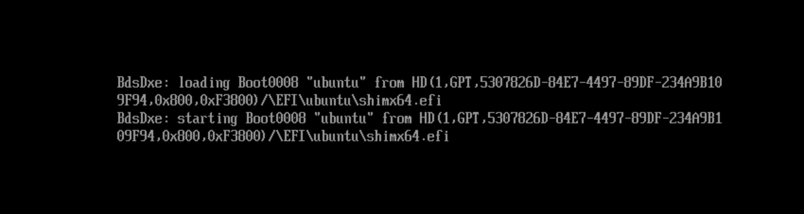

```
$ lsblk -f /dev/sda
NAME   FSTYPE FSVER LABEL    UUID                                 
sda                                                              
├─sda1 vfat   FAT32          1E86-1FD7                           
└─sda2 ext4   1.0   ubuntu18 b8ce0513-b0be-43cb-ba50-bbefb37072a2
```

```
$ sudo mount /dev/sda1 /tmp/sda1/
$ tree /tmp/sda1
/tmp/sda1
└── EFI
    ├── BOOT
    │   ├── BOOTX64.EFI
    │   └── fbx64.efi
    └── ubuntu
        ├── BOOTX64.CSV
        ├── grub.cfg
        ├── grubx64.efi
        ├── mmx64.efi
        └── shimx64.efi
```

```
$ sudo qemu-system-x86_64 -cpu host -enable-kvm \
    -smp 2 -m 2G \
    -bios /usr/share/qemu/OVMF.fd \
    -hda /dev/sda
```



```
grub>ls
(hd0,gpt1)  (hd0,gpt2)

grub>ls (hd0,gpt1)/efi/ubuntu
BOOTX64.CSV grub.cfg grubx64.efi mmx64.efi shimx64.efi
```

```
$ cat /tmp/sda1/EFI/ubuntu/grub.cfg 
search.fs_uuid b8ce0513-b0be-43cb-ba50-bbefb37072a2 root hd0,gpt2 
set prefix=($root)'/boot/grub'
configfile $prefix/grub.cfg
```

```
$ sudo mount /dev/sda2 /tmp/sda2/
$ ll /tmp/sda2/boot/grub/grub.cfg
ls: cannot access '/tmp/sda2/boot/grub/grub.cfg': No such file or directory
```

Поместил туда файл, но qemu его не видит. Та же ситуация, то и с шлешкой и с лже-диском в RAM.